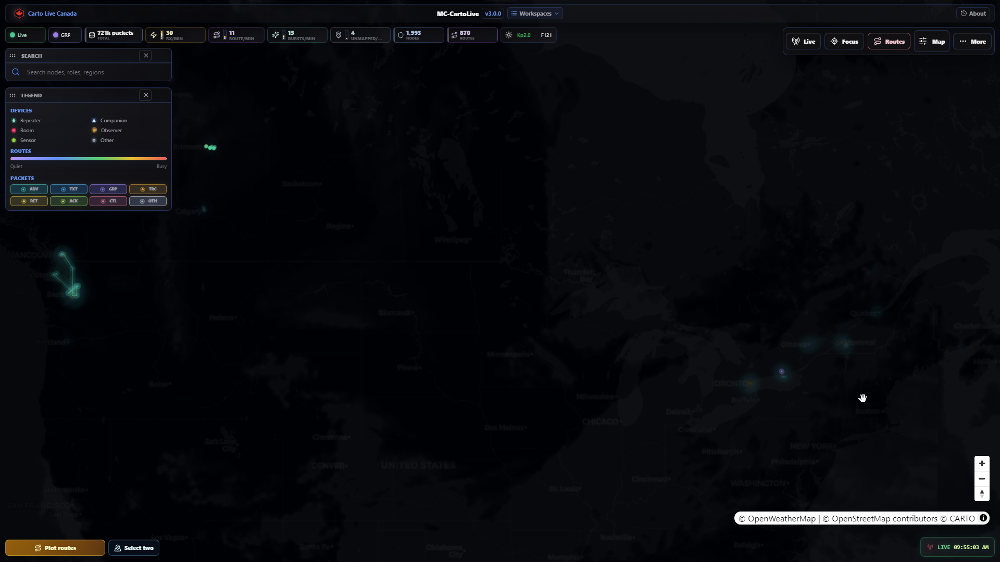
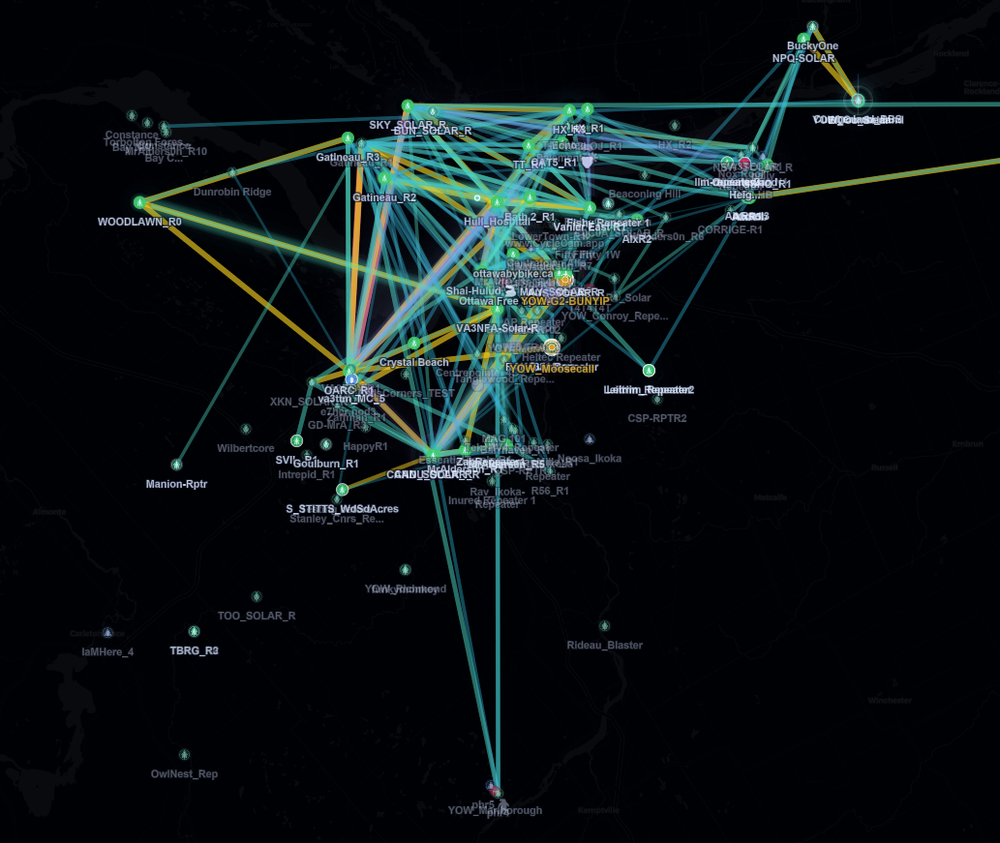
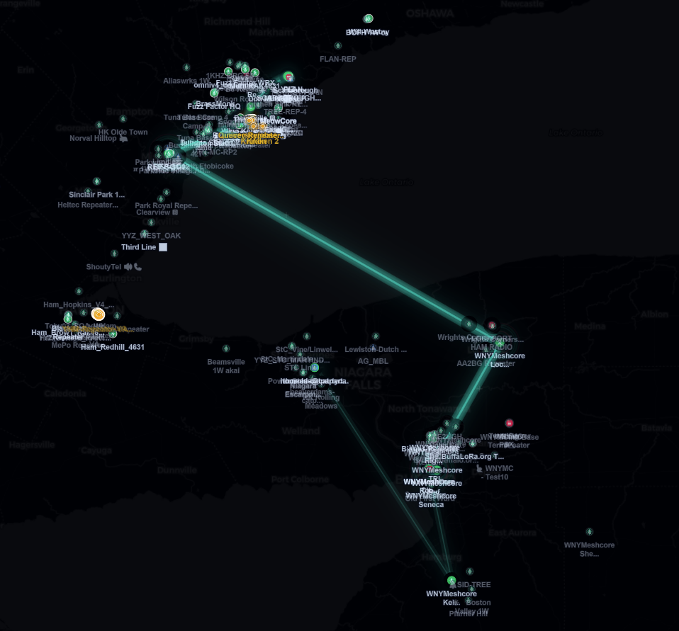
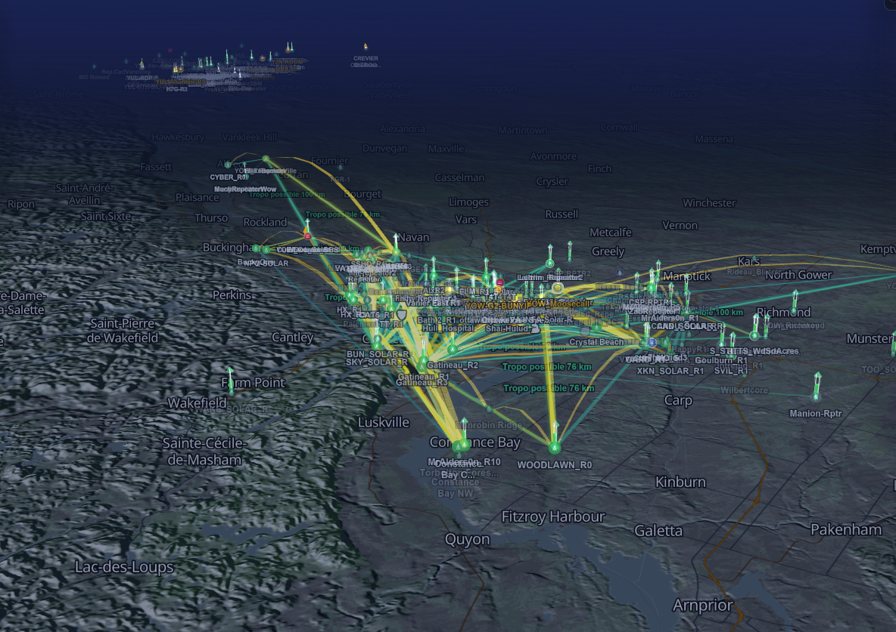
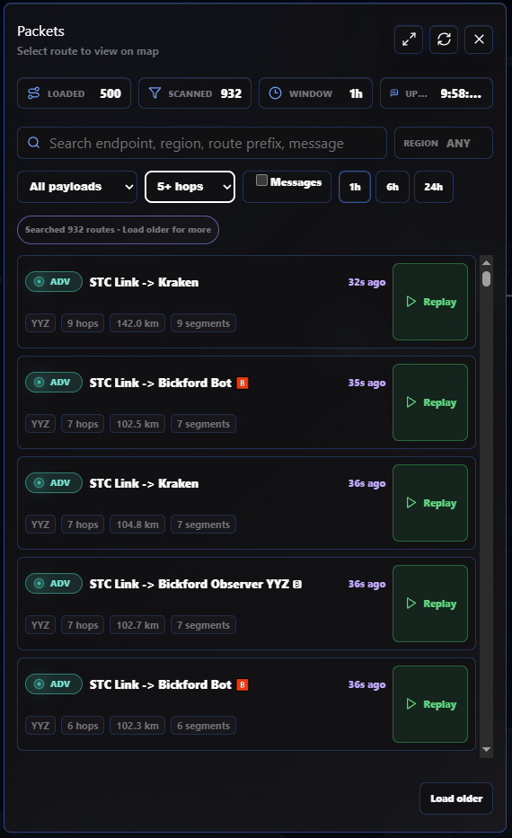
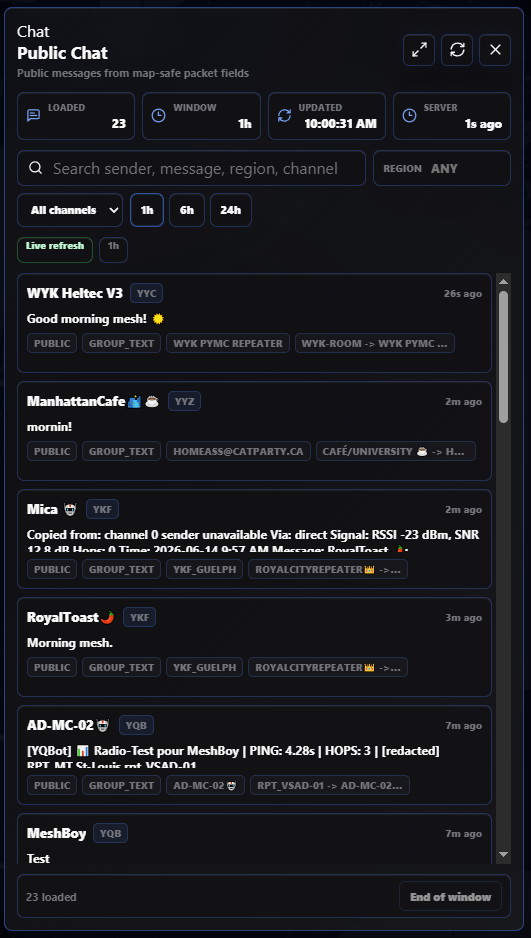
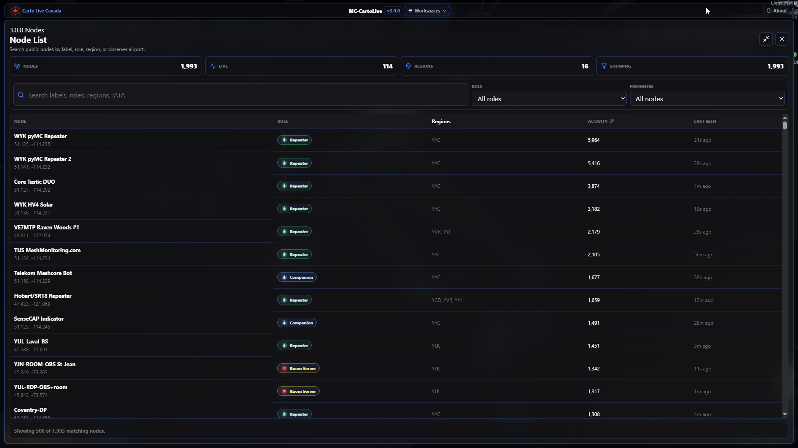
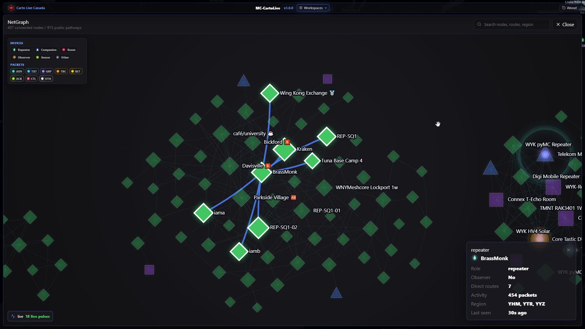
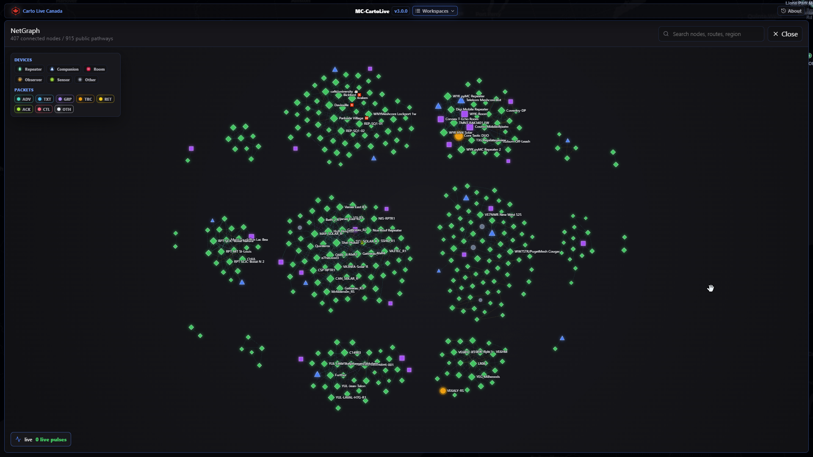
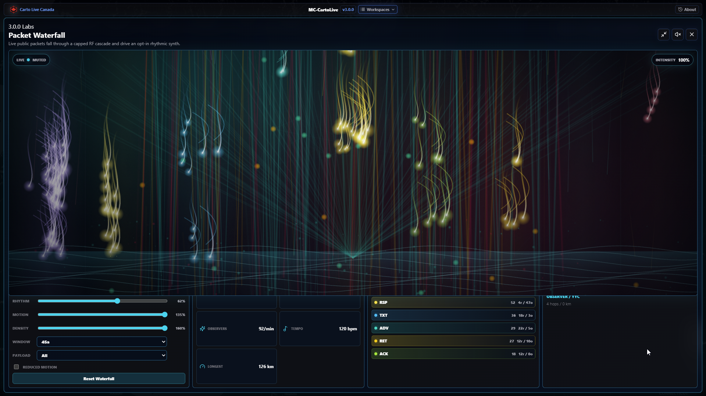

# MeshCore MQTT Live Map v3.2.0

**MC-CartoLive** is a single-container public live map for MeshCore MQTT
observations. It ingests broker traffic, stores normalized observations in
SQLite, resolves only high-confidence RF routes, and serves a privacy-safe
MapLibre dashboard for live packet motion, public chat, replay, Packets,
NetGraph, Node List, Labs, and optional propagation/terrain context.

Public instance: [carto.canadaverse.org](https://carto.canadaverse.org/).

## Current Release

Version 3.2.0 is the reliability, storage, and visual-showcase release. It folds
the unreleased 3.1 work into one supported package and adds:

- RF Replay Studio for privacy-safe route timelines, 2D/3D traversal, observer
  bursts, Waterfall synchronization, deep links, and client-side export
- a compact, accessible desktop/mobile shell with bounded dialog focus,
  reduced-motion behavior, and on-demand visual code
- reset-safe public event cursors, a compact bootstrap endpoint, viewport
  clusters, and public-safe dataset/storage/MQTT session health
- seven-day observation retention and 24-hour public-event retention backed by
  versioned SQLite schema migration and bounded maintenance
- immutable release identity compiled into the binary and frontend
- one multi-platform GHCR candidate promoted by digest, with provenance, SBOM,
  checksums, vulnerability gates, and a deployment bundle
- a destructive fresh-database deployment mode that is impossible to invoke
  accidentally and a restart-loop-resistant production watchdog
- privacy-safe automated 24-hour, day-8, and day-14 retention/storage evidence
  with a durable day-8 growth baseline

Published releases run from an immutable GHCR digest through the production
Compose package. The repository Compose file remains the local build path.

## 3.0 Screenshot Tour

These are public UI captures from the 3.0 Canada surface.

### Map, Routes, And Replay

| Live map overview | Route density | Packet flow replay |
| --- | --- | --- |
|  |  |  |

| OpenFreeMap 3D terrain |
| --- |
|  |

### Workspaces

| Packets | Chat | Node List |
| --- | --- | --- |
|  |  |  |

### NetGraph And Labs

| NetGraph focus | NetGraph overview | Packet Waterfall Labs |
| --- | --- | --- |
|  |  |  |

## Capabilities

- Read-only MQTT ingest with MeshCore packet decoding.
- SQLite persistence under `data/` locally or `/app/data` in the container.
- Seven-day raw/event/search retention by default, with compact latest-route
  summaries retained so the live route graph survives database pruning.
- Conservative public route resolution; ambiguous or unsafe paths are not drawn.
- Public MapLibre dashboard with clusters, nodes, labels, live packet comets,
  fading trails, message bubbles, route plotting, replay, and optional 3D.
- Packets, Chat, NetGraph, Node List, Labs, and propagation history workspaces
  built from sanitized public data.
- Public-safe health/readiness endpoints and release smoke scripts.
- Worldwide/private broker support through configurable map bounds and region
  labels.

## Quick Start

Credential-free fixture mode is the safest local test path:

```bash
cp .env.example .env
podman build --format docker -t mc-cartolive-meshcore-live-map:latest .
podman run --rm --name mc-cartolive -p 39476:8080 --env-file .env mc-cartolive-meshcore-live-map:latest
```

Open `http://127.0.0.1:39476`.

The published image can also run the synthetic fixture:

```bash
podman run --rm -p 8080:8080 \
  -e MQTT_ENABLED=false \
  -e PUBLIC_MODE=true \
  -e PUBLIC_BASE_URL=http://localhost:8080 \
  -e FIXTURE_REPLAY_PATH=/app/examples/fixtures/synthetic-live.ndjson \
  ghcr.io/n30nex/mc-cartolive:3.2.0
```

For a persistent deployment:

```bash
podman run -d --name mc-cartolive \
  -p 8080:8080 \
  --env-file .env \
  -v mc-cartolive-data:/app/data \
  ghcr.io/n30nex/mc-cartolive:3.2.0
```

The production droplet currently uses Docker Compose; local release validation
uses Podman unless a host is Docker-only.

## Configuration

Start from `.env.example`. Keep real `.env` files private.

Important variables:

| Variable | Notes |
| --- | --- |
| `PUBLIC_MODE` | Use `true` for public deployments. |
| `PUBLIC_BASE_URL` | Must match the public browser origin for WebSocket checks. |
| `MQTT_ENABLED` | `false` for fixtures, `true` for live broker ingest. |
| `MQTT_USERNAME` / `MQTT_PASSWORD` | Private broker credentials. Never commit them. |
| `MESHCORE_CHANNEL_SECRETS` | Optional private extra channel keys for operators. |
| `FIXTURE_REPLAY_PATH` | Synthetic fixture path for repeatable local demos. |
| `MAP_REGION_PRESET` | `world`, `canada`, or `custom`. |
| `VITE_APP_ASSET_PACK` | Build-time frontend asset preset: `world` by default, `canada` for the hosted Canada release. |
| `MAP_BOUNDS` | Custom bounds as `minLat,minLng,maxLat,maxLng`. |
| `PUBLIC_REGIONS` | Public-safe broker region allowlist. Empty allows safe labels. |
| `DB_PATH` | SQLite path inside the container. |
| `SQLITE_READ_OPEN_CONNS` | Read-only SQLite pool size. Production uses `2`; the writer remains a single connection. Legacy `SQLITE_MAX_OPEN_CONNS` is accepted only as a fallback. |
| `SQLITE_BUSY_TIMEOUT_MS` | Per-attempt SQLite lock wait. Production uses `750` ms inside the single five-second primary ingest deadline. |
| `DERIVED_INGEST_QUEUE_SIZE` | Bounded lower-priority resolver/projection queue. Defaults to `1024`. |
| `METRICS_LISTEN_ADDR` | Dedicated metrics listener. Defaults to `127.0.0.1:9090`; Docker publishes it only on host loopback port `39090`. |
| `SQLITE_CACHE_SIZE_KB` | SQLite page cache budget in KiB. Defaults to `16000`. |
| `SQLITE_MMAP_SIZE_BYTES` | SQLite mmap budget in bytes. Defaults to `67108864`. |
| `DATA_RETENTION_DAYS` | Raw packets, observations, live edge events, public history/search rows, and propagation/weather history retention. Defaults to `7`; latest public route summaries are preserved separately. |
| `PUBLIC_EVENT_RETENTION_HOURS` | Public WebSocket-resume event history. Production fixes this to `24`. |
| `ALLOW_UNBOUNDED_RETENTION` | Development escape hatch only. Enabling it in public mode keeps readiness fail-closed. |
| `PROPAGATION_EVENT_RETENTION_DAYS` | Optional propagation-only override. Defaults to `7`. |
| `VITE_PMTILES_BASEMAP_URL` | Optional same-origin or CSP-allowed PMTiles basemap for offline profiles. |
| `VITE_PMTILES_TERRAIN_URL` | Reserved optional PMTiles terrain archive URL for future terrain swaps. |

## Development

Backend:

```bash
cd backend
go test ./...
go run ./cmd/app
```

Frontend:

```bash
cd web
npm ci
npm test -- --run
npm run build
```

Release hygiene:

```bash
node scripts/check-version-sync.mjs
node scripts/public-schema-check.mjs
node scripts/check-asset-pack.mjs
node scripts/check-frontend-budget.mjs
node scripts/check-public-privacy.mjs http://127.0.0.1:39476
podman build --format docker -t mc-cartolive-meshcore-live-map:latest .
node scripts/package-smoke.mjs --runtime podman --image ghcr.io/n30nex/mc-cartolive:3.2.0 --pull
```

Live post-deploy smoke:

```powershell
.\scripts\live-smoke.ps1 -BaseUrl https://carto.canadaverse.org -ExpectedVersion 3.2.0 -ExpectedGitSha <full-sha> -DiagnoseRegion YTR
```

## Documentation

- [Docs index](docs/README.md)
- [Production deployment](docs/production.md)
- [Development guide](docs/development.md)
- [Operator runbook](docs/operator-runbook.md)
- [Privacy model](docs/privacy.md)
- [Roadmap](docs/roadmap.md)
- [Changelog](CHANGELOG.md)
- [3.2.0 release notes](docs/3.2.0/release_notes.md)
- [3.2.0 validation checklist](docs/3.2.0/validation_checklist.md)
- [3.2.0 storage and preservation policy](docs/3.2.0/storage-and-fresh-start.md)
- [3.2.0 upgrade and rollback](docs/3.2.0/upgrade-and-rollback.md)
- [3.2.0 public API changes](docs/3.2.0/public-api.md)
- [3.0.2 release notes](docs/3.0.2/release_notes.md)
- [3.0.2 validation checklist](docs/3.0.2/validation_checklist.md)
- [3.0.1 release notes](docs/3.0.1/release_notes.md)
- [3.0.1 validation checklist](docs/3.0.1/validation_checklist.md)
- [3.0.0 release notes](docs/3.0.0/release_notes.md)
- [3.0.0 screenshot tour](docs/3.0.0/screenshot_tour.md)
- [3.0.0 asset pack notes](docs/3.0.0/asset_pack.md)
- [3.0.0 validation checklist](docs/3.0.0/validation_checklist.md)
- [2.9.6 release notes](docs/2.9.6/release_notes.md)
- [2.9.5 release notes](docs/2.9.5/release_notes.md)
- [2.9.4 release notes](docs/2.9.4/release_notes.md)
- [2.9.3 release notes](docs/2.9.3/release_notes.md)

## Privacy Boundary

Never commit or expose MQTT credentials, MeshCore private keys, channel secrets,
live SQLite databases, WAL/SHM files, local operator config, or raw packet
captures.

Public APIs must not expose full public keys, observer public keys, packet
hashes, raw payloads, raw path hex, resolver debug reasons, broker secrets, or
private operator config. The only public route-copy identifier is the
six-character MeshCore `pathHash3` prefix.
